# 2018 Hacktoberfest Leaderboard Signup

Get some street cred by placing your name on the Techlahoma 2018 Hacktoberfest leaderboard!

Leaderboard webpage: [hfleaderboard.herokuapp.com](https://hfleaderboard.herokuapp.com/)

Leaderboard repo: [github.com](https://github.com/austinwk/hacktoberfest_leaderboard)

### About

[Hacktoberfest](https://hacktoberfest.digitalocean.com/) is a month-long celebration of open source software. Some great companies have partnered up to get the community involved in contributing to open source projects on GitHub. As an incentive to participate, they will send you a 100% free Hacktoberfest t-shirt if you submit 5 pull requests in the month of October.

To help add some extra motivation to the Techlahoma community, I created a leaderboard that shows how many pull requests each member has contributed so far in October. Want to get on the board? Add your name to the `participants.json` file above by submitting a pull request and you will be automatically added to the leaderboard. _And_ you knock out one of your 5 pull requests. That's a win-win!

Not sure how to submit a pull request? Follow the step-by-step guide below to see how! And, as always, don't be afraid to ask questions. Join the #Hacktoberfest channel on the Techlahoma Slack for help (join at [slack.techlahoma.org](http://slack.techlahoma.org/)).

### Guide to your first Pull Request
Follow these steps to score your first pull request and get your name on the [Hacktoberfest Leaderboard](https://hfleaderboard.herokuapp.com/)!

---

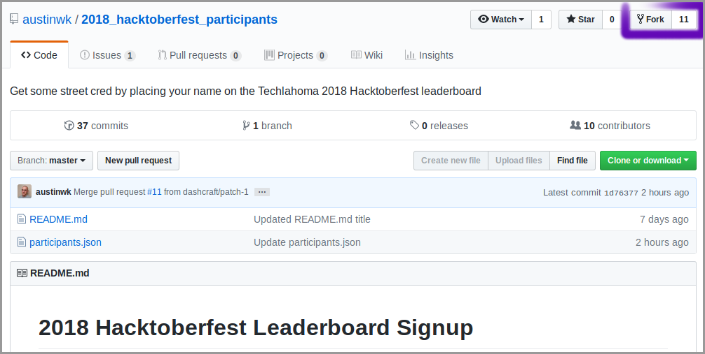

1. Go to the [2018_hacktoberfest_participants](https://github.com/austinwk/2018_hacktoberfest_participants) repository and click the **Fork** button in the top right corner.

---

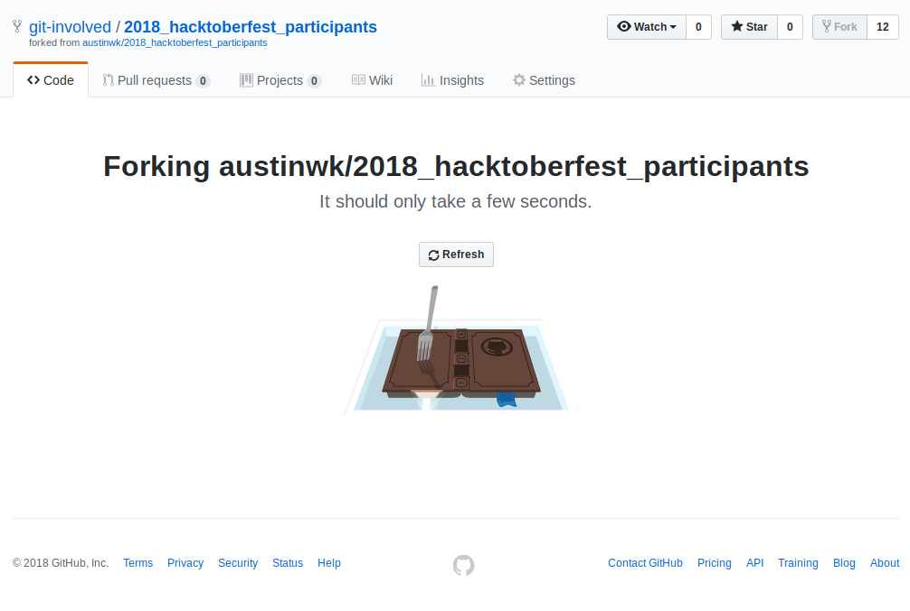

2. An animation will play while the files are being replicated to a repository on your account.

---

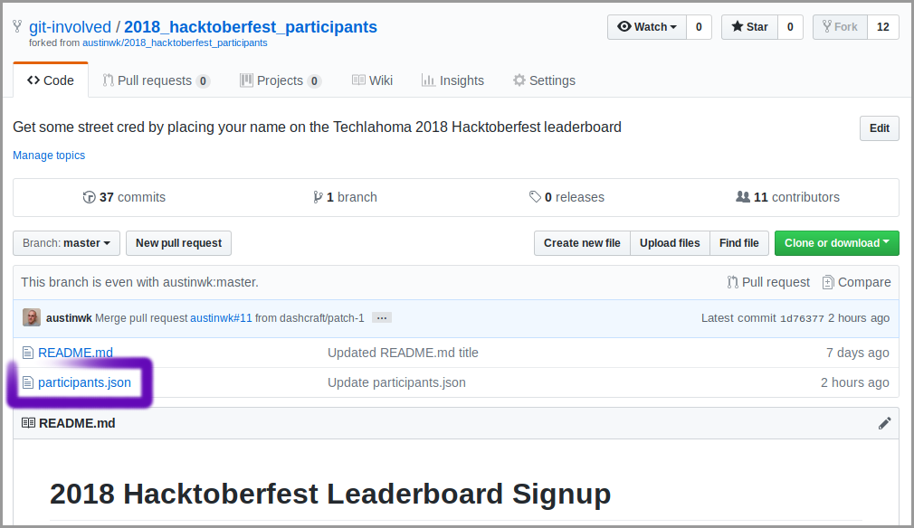

3. Once the forking opertion has completed, you will be in _your_ version of the repository. Click on `participants.json`. This is the file containing the names of everyone that wants to be on the leaderboard.

---

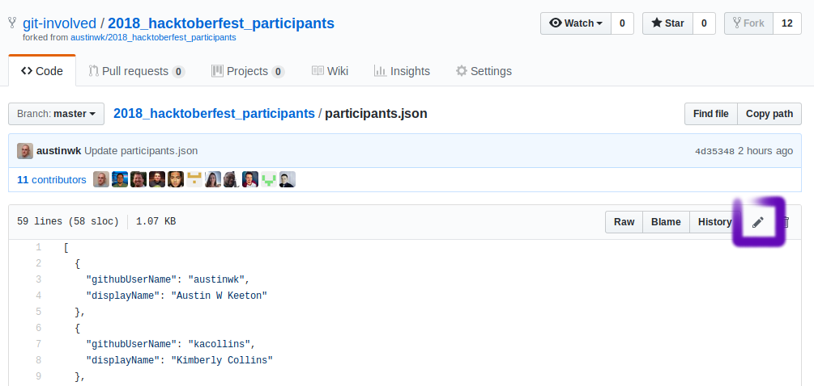

4. Click on the pencil icon to begin editing the file.

---

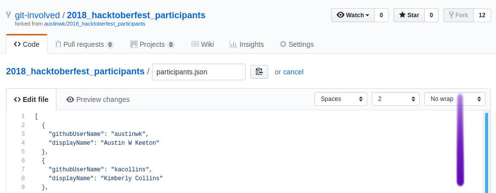

5. Scroll down to the bottom of the page.

---

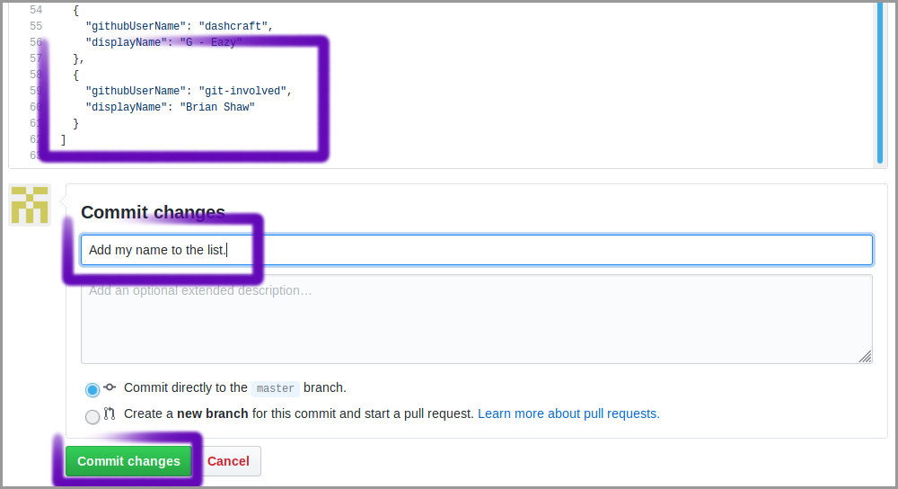

6. In the same format as the items above, insert your name and your GitHub username between the last `}` and the final `]`. Here is an example:

    ```
        ...
        },
        {
            githubUserName: "kiteflyer",
            displayName: "Benjamin Franklin"
        }
    ]
    ```

   Be as thorough as possible, but if you make a mistake, don't worry about it. The person reviewing it will be able to fix any errors before accepting your changes.

7. Next, type a short description of the change into the **Commit changes** field. It should be concise, to the point, and descriptive. Imperative mood is preferred. "Add my name to the list" is perfect.

8. Last, click the green **Commit changes** button in the bottom left of the screen.

---

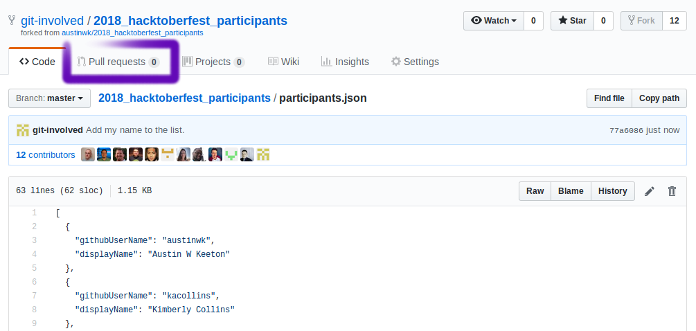

9. Click the **Pull requests** tab at the top of the screen.

---

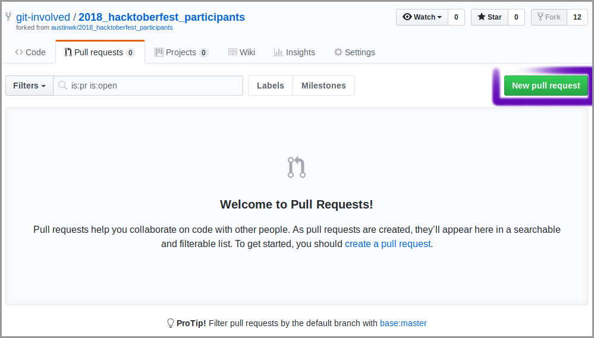

10. Click the green **New pull request** button.

---

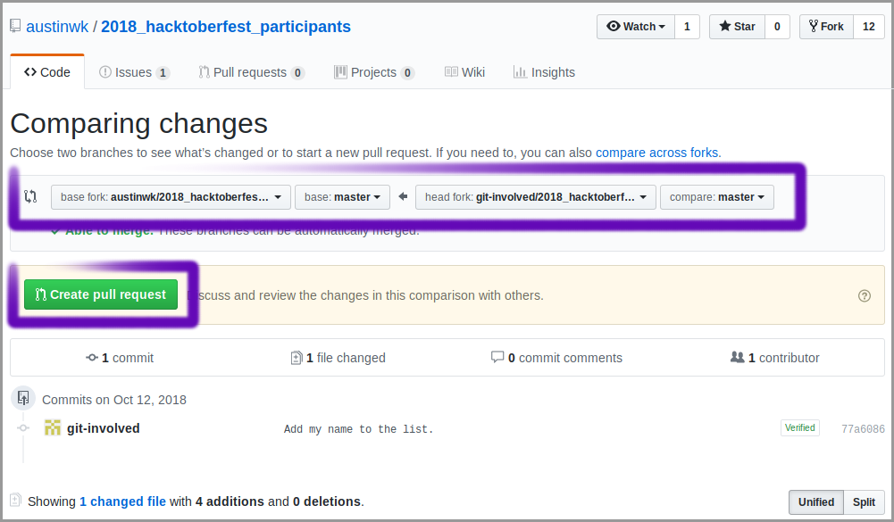

11. Notice the highlighted bar at the top. Read it right to left. Your changes are being passed from your version of the repository to the original repository. No need to change anything. Click the green **Create pull request** button.

---

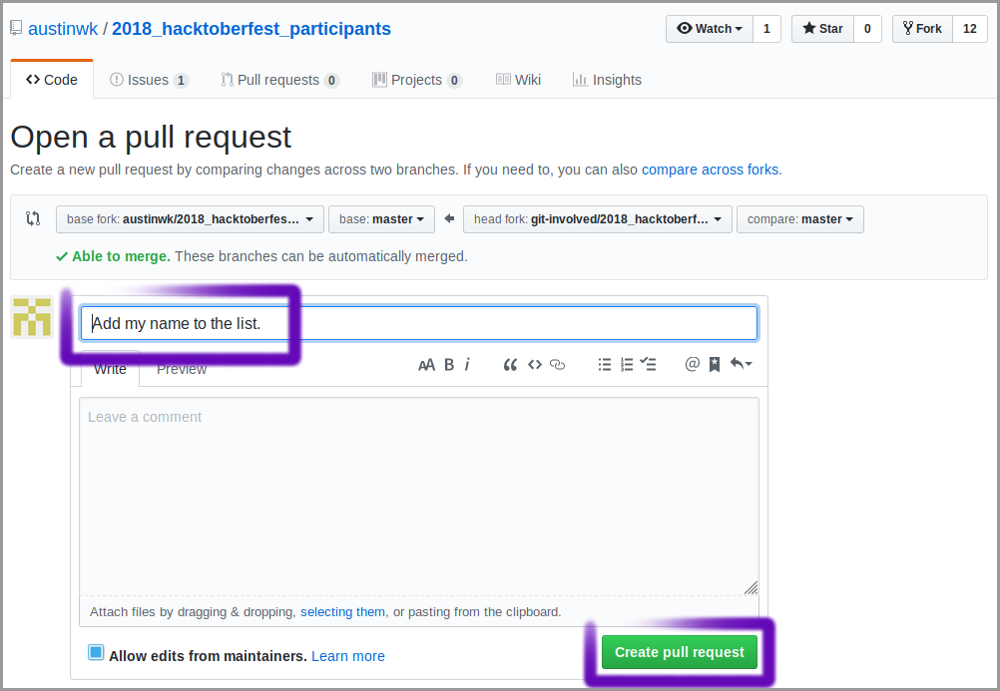

12. The comment that you entered in step 6 should appear. No need to change anything. Click the green **Create pull request** button.

---

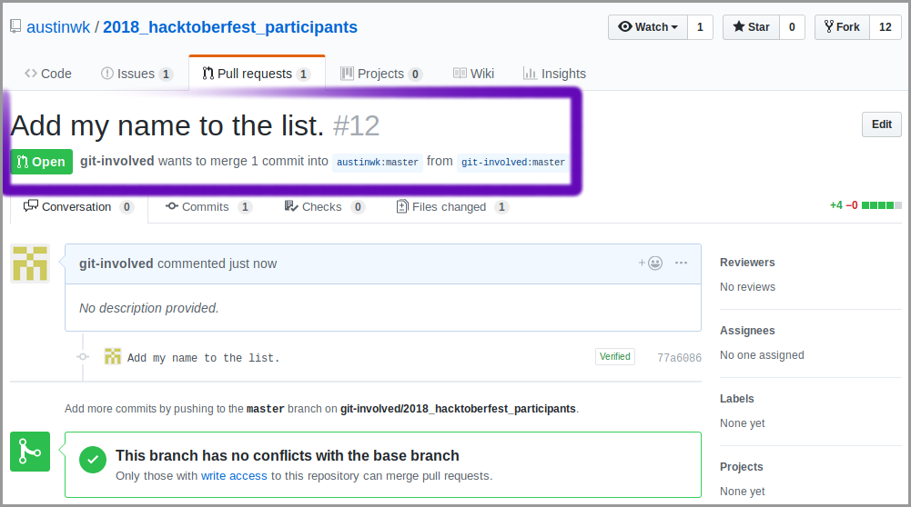

13. CONGRATULATIONS! You just submitted your first Pull Request. As you can see in the highlighted area, it has been assigned a number--in this case, 12. Now it is up to the owner of the repository to review your changes, make any edits, and then merge it into their branch. Once your changes have been merged, you should receive an email:

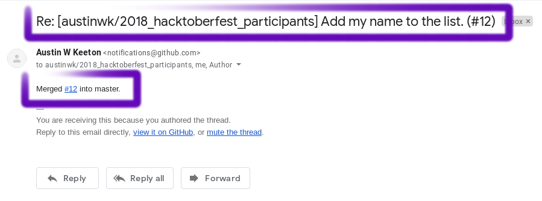

Now, go to [hfleaderboard.herokuapp.com](https://hfleaderboard.herokuapp.com/) to check out your ranking! Remember, you need to sign up at [hacktoberfest.com](https://hacktoberfest.digitalocean.com/) _and_ get 5 pull requests before the end of October to get the shirt. If you need ideas for more pull requests, don't be afraid to ask in the #Hacktoberfest channel of the Techlahoma Slack (join at [slack.techlahoma.org](http://slack.techlahoma.org/)).